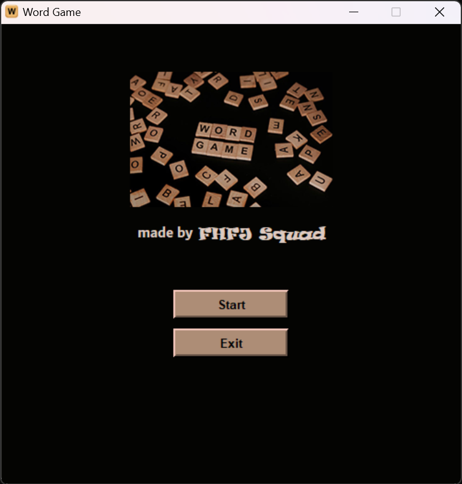
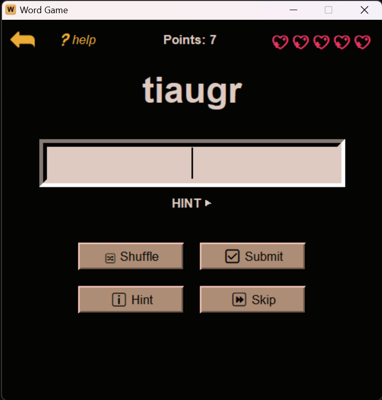

# Word Jumble Game

A fun and challenging word game built using Python's Tkinter library.

## Description

Word Jumble Game is a simple yet addictive game where players need to unscramble shuffled words to earn points. With features like hints, shuffling, and skipping, players can test their vocabulary skills while enjoying the game.

## Features

- `Shuffle Button`: Reshuffle the letters of the word if you're stuck.
- `Hint Button`: Get a hint for the word. Each hint deducts a point from your score.
- `Skip Button`: Skip a word if you're unable to guess it. Skipping deducts 4 points from your score.
- `Submit Button`: Enter your guess in the input field and click this button to check if it's correct.
- `Lives`: Start with 5 lives represented by heart emojis (💖). Each incorrect guess deducts one life.
- `Points`: Earn points for correct guesses. Your current score is displayed at the top.
- `High Scores`: Your highest score achieved in the game will be displayed when the game ends.

## Installation

#### Download Executable

If you prefer not to clone the repository, you can download the executable file directly:
[Download Word Game Executable](https://github.com/madefromjames/digital_fortress_python_project/blob/main/word_game.exe). You might disable antivirus and ignore any warnings

#### Clone Repository (Manual Installation)

#### _Requirements_

Before running the game, ensure you have the following dependencies installed:

- **Python 3.x**
     - You can install Python from the [official website](https://www.python.org/downloads/).
- **Tkinter** (usually included with Python installation)
    - Try running `python -m tkinter` in your terminal, and observe if it opens a blank Tkinter window. If it does, then Tkinter is installed and working. If you encounter an error message, it indicates there may be an issue with your Tkinter installation.

`git clone https://github.com/madefromjames/digital_fortress_python_project.git`

- Navigate to the project directory:
    - `cd digital_fortress_python_project`
- Run the game:
    - `python word_game.py`

## How to Play

1. **OBJECTIVES**: Guess the shuffled word correctly to earn points.
2. **SHUFFLE BUTTON**: Use this button to reshuffle the letters of the word if you're stuck.
3. **HINT BUTTON**: Get a hint for the word by clicking this button. Each hint deducts a point from your score.
4. **SKIP BUTTON**: Skip a word if you're unable to guess it. Skipping deducts 4 points from your score.
5. **SUBMIT BUTTON**: Enter your guess in the input field and click this button to check if it's correct.
6. **LIVES**: You start with 5 lives represented by heart emojis (💖). Each incorrect guess deducts one life.
7. **POINTS**: Earn points for correct guesses. Your current score is displayed at the top.

Have fun and good luck! 🍀

## Screenshots

## Credits

This game was developed by FHFJ Squad.

- [@madefromjames](https://github.com/madefromjames)
- [@Gracehills](https://github.com/Gracehills)
- [@Rubbercolt](https://github.com/Rubbercolt)
- [@UnSired-Security](https://github.com/UnSired-Security)

__Feel free to customize it further with additional sections or information specific to your game!__ 😊